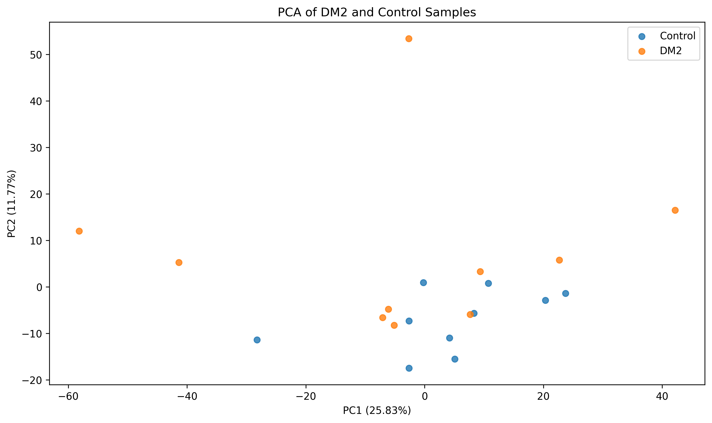
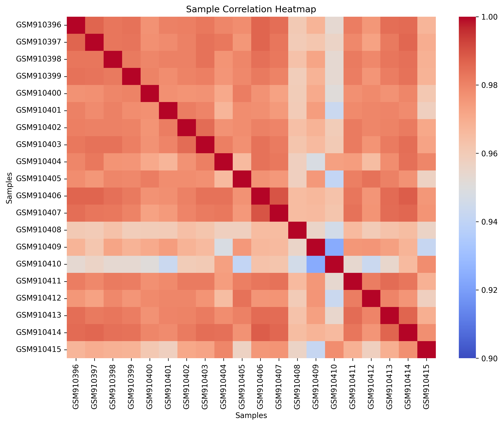
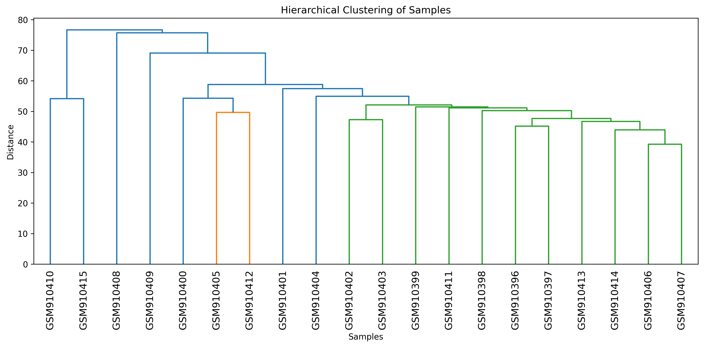
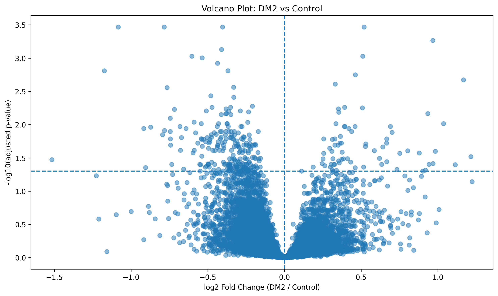
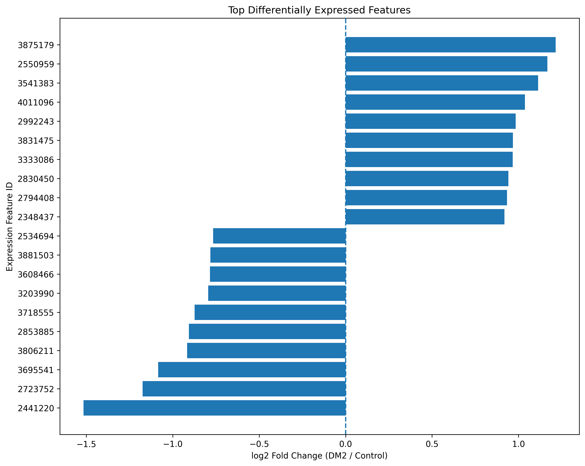

# DM2 Transcriptomic Analysis

Python-based analysis of transcriptomic expression features from skeletal muscle samples of patients with Myotonic Dystrophy Type 2 (DM2) compared with Control samples.

## Project Overview

This project analyzes the expression data from the GEO dataset **GSE37084**, which contains skeletal muscle transcriptomic profiles from:

* 10 Control samples
* 10 DM2 samples
* 22,011 expression features after removal of the GEO table-end marker

The analysis was performed in Python using Pandas, NumPy, SciPy, Statsmodels, Scikit-learn, and Matplotlib.

## Research Question

Which expression features show statistically significant differences between DM2 and Control samples?

## Analysis Workflow

The notebook performs the following steps:

1. Load and clean the expression matrix.
2. Separate samples into Control and DM2 groups.
3. Calculate group-wise mean expression.
4. Calculate log2 fold change.
5. Perform independent two-sample t-tests.
6. Apply Benjamini-Hochberg false discovery rate (FDR) correction.
7. Identify statistically significant features.
8. Examine sample-level variation using:

   * Principal Component Analysis (PCA)
   * Sample correlation analysis
   * Hierarchical clustering
9. Visualize differential expression using a volcano plot.
10. Visualize the top increased and decreased expression features.
11. Export the complete differential-expression results as a CSV file.

## Key Results

| Result                             |  Count |
| ---------------------------------- | -----: |
| Total expression features analyzed | 22,011 |
| FDR-significant features           |    304 |
| Increased features in DM2          |     72 |
| Decreased features in DM2          |    232 |
| Non-significant features           | 21,707 |

Significance threshold: **adjusted p-value < 0.05**

The analysis identified 304 expression features with statistically significant differences between the DM2 and Control groups after multiple-testing correction.

## Sample-Level Analysis

PCA, correlation analysis, and hierarchical clustering showed substantial variation among samples.

The Control and DM2 groups did not show complete separation in PCA or hierarchical clustering, indicating that sample-level heterogeneity should be considered when interpreting the differential-expression results.

## Visualizations

### PCA



### Sample Correlation Heatmap



### Hierarchical Clustering



### Volcano Plot



### Top Differential Features



## Results File

The complete differential-expression results are provided in:

`DM2_vs_Control_differential_expression_results.csv`

The file contains:

* ID_REF
* Control mean expression
* DM2 mean expression
* log2 fold change
* p-value
* adjusted p-value

## Important Interpretation Note

The identifiers in this analysis are reported as **expression feature/probe identifiers**. Gene-level annotation was not included in the final analysis; therefore, this project does not make unsupported gene-specific or pathway-level claims.

## Methodological Limitations

This project is intended as a practical transcriptomic data-analysis project.

The differential-expression analysis used independent two-sample t-tests followed by Benjamini-Hochberg FDR correction. For publication-grade microarray analysis, methods such as **limma with empirical Bayes moderation**, together with appropriate experimental-design modeling and probe/transcript annotation, would generally be preferable.

Therefore, the results should be interpreted as a reproducible educational analysis rather than a definitive clinical or biological conclusion.

## Dataset

**GEO accession:** GSE37084

The raw GEO dataset is not included in this repository. The repository contains the analysis notebook, derived results, and visualization outputs.

## Tools and Libraries

* Python
* Pandas
* NumPy
* SciPy
* Statsmodels
* Scikit-learn
* Matplotlib
* Jupyter Notebook / Google Colab

## Repository Contents

```text
dm-2-transcriptomic-analysis/
├── README.md
├── DM2_transcriptomic_analysis.ipynb
├── DM2_vs_Control_differential_expression_results.csv
├── pca_plot.png
├── correlation_heatmap.png
├── hierarchical_clustering.png
├── volcano_plot.png
└── top_differential_features.png
```
